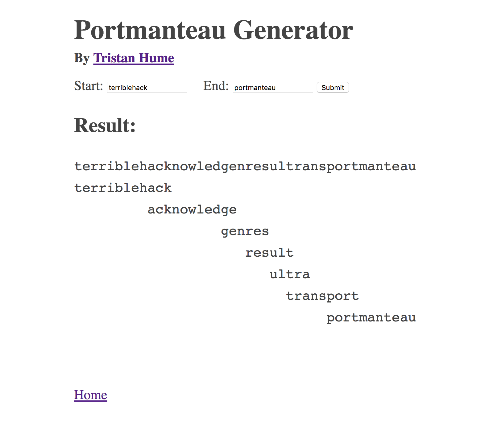
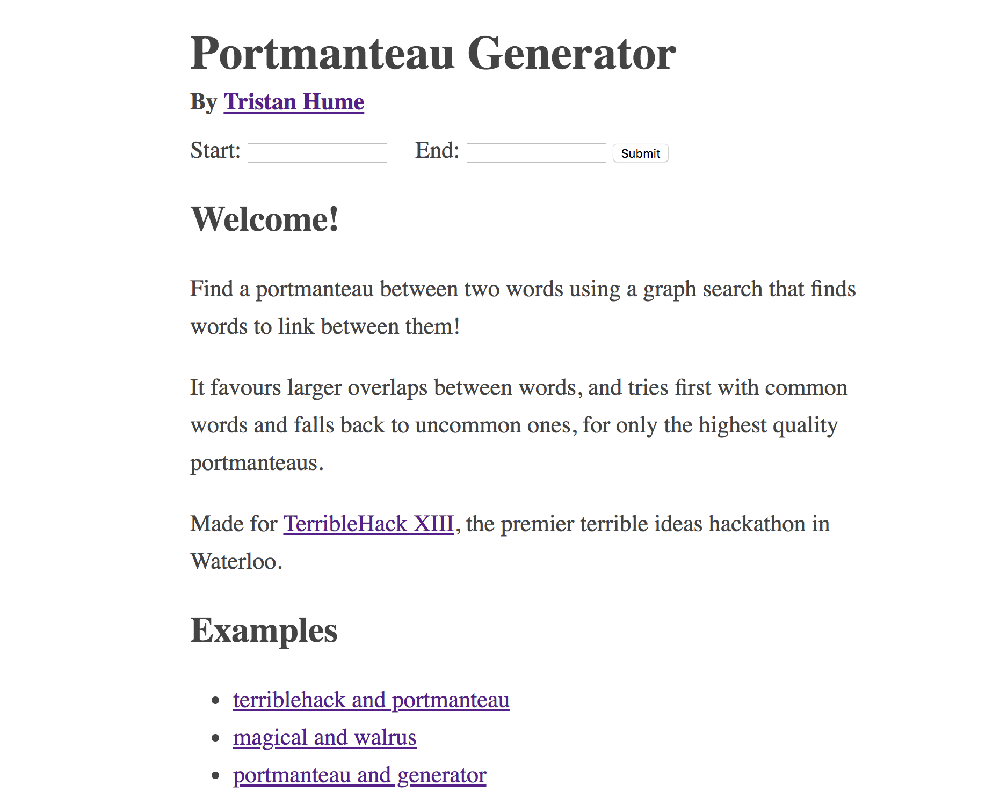

# Portmanteau Generator

Finds a portmanteau between two words using a graph search that finds words to link between them!

It favours larger overlaps between words, and tries first with common words and falls back to uncommon ones, for only the highest quality portmanteaus.

## How I built it

It's a Rust program that hosts a web app. The searching is done on the backend using a custom graph search implementation and prefix data store to link words together quickly.

## Why though

Made for TerribleHack XIII, the premier terrible ideas hackathon in Waterloo.

## Screenshots

